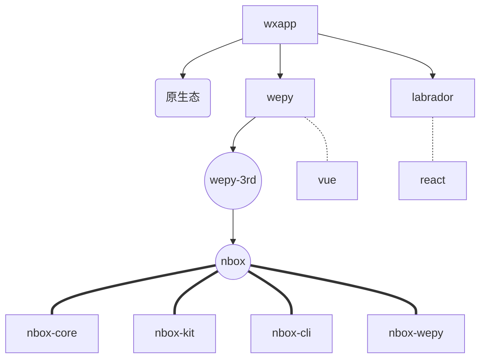
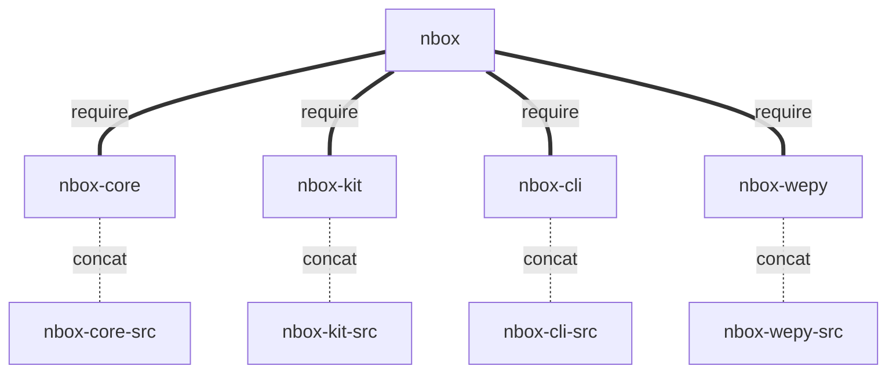
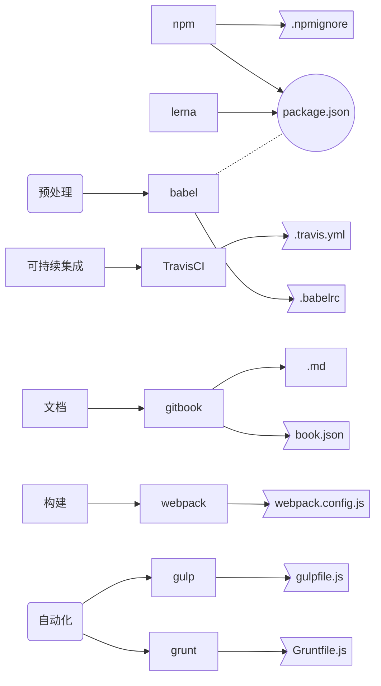

# nbox
npm and js utils box

[TOC]

# nbox.js

      

## 简介
### 心路历程

### 实现细节

### 开源已接触

## 解决问题
 - [x] 前后端、各项目间公用代码
 - [x] 存放学习代码 nbox-core/test/{_in, _3rd}

## 参考
- [阮一峰 - 持续集成服务 Travis CI 教程](http://www.ruanyifeng.com/blog/2017/12/travis_ci_tutorial.html)
- [wepy]()
- lerna
- gulp grunt
- babel
- node package
- react - labrada

## sub projects
- [**nbox**](packages/nbox/README.md)
- [**nbox-cli**](packages/nbox-cli/README.md)
- [**nbox-core**](packages/nbox-core/README.md)
- [**nbox-kit**](packages/nbox-kit/README.md)
- [**nbox-wepy**](packages/nbox-wepy/README.md)
